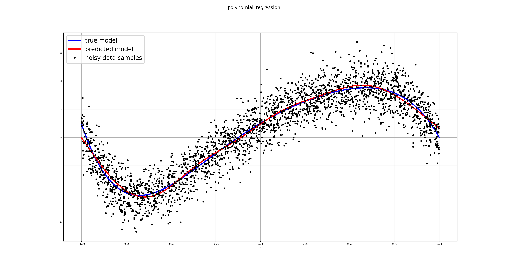

# Polynomial Regression with NumPy

This is an example of a simple machine learning algorithm implementation. This example demonstrates the polygonal regression problem through a simple one layer neural network and backpropagation through the graph using stochastic gradient descent. Entire algorithm is implemented using just the numpy library and is helpful for understanding basic concepts of machine learning.

The toy problem set up here is to define an `n-th` order polynomial function, and then generate noisy data points from this function. The goal is to learn the coefficients of the polynomial function that best fit the data through a simple one layer neural network.

